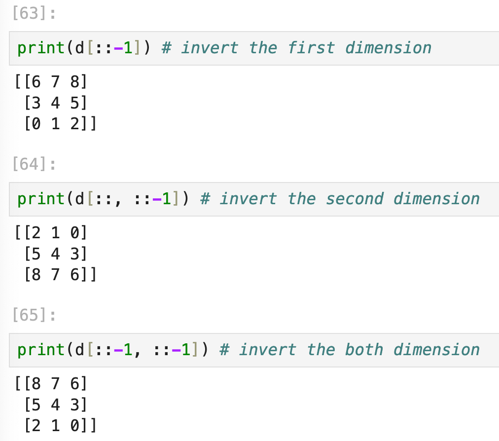

Lecture 2 2024.10.8

# Scientific Python: Numpy, SciPy and Matplotlib

### Objectives:

1. NumPy Arrays
2. Basic array manipulation
3. Vectorial Code
4. Overview of Scipy
5. Create 2D plot with docoration
6. Merging multiple plots

## Numpy

A key buliding block used by SciPy

### Numpy Arrays

- A core Python Library provides lists and 1D arrays
- Providing multidimensional arrays `numpy.ndarray`

### Creating 1D Arrays

````python
import numpy as np

a = np.array([-1, 0, 1])
print(a) #[-1  0  1]
print(type(a)) # <class 'numpy.ndarray'>
````

Data types can also be specified at creation:

```python
a = np.array([1, 2, 3], np.float64)
print(a)
# [1. 2. 3.] float64
```


### Using Numpy Functions

#### np.arange

 `np.arange(start, end, step)` 

Generate an array based on the 1 / 2 / 3 parameter given (end is not included.

````python
a = np.arange(6) # [0 1 2 3 4 5]
aa = np.arange(-2, 6) #[-2 -1 0 1 2 3 4 5]
aaa = np.arange(-2, 6, 2) #[-2 0 2 4]
````

#### np.linspace

`np.linspace(start, end, size)` 

Generate an array by evenly placing the figures between `start` and `end` parameter

````python
b = np.linspace(-10, 10, 4)
# [-10. -3.33333 3.33333 10. ]
````

### Mult-dimensional Arrays

````python
c = np.array([[[1, 2], [3, 4]], [[5, 6], [7, 8]]])
pprint(c)
# array([[[1, 2],
#        [3, 4]],
#
#       [[5, 6],
#        [7, 8]]])
````

`c.shape = (2, 2, 2)`

#### Creating Arrays with `NumPy` Funcitons

```py
np.zeros(3, 3)
np.ones(3, 3)
np.eye(3) = np.identity(3)
np.full((3, 3), 5) # Create an array and filled with a given vaule
np.diag([1, 2, 3]) # Create an array by placing the values on the diagnol
np.tri(3) # Create a lower triangle matrix
```

#### Using Tuple for indexing

Better to use a **tuple** to pick element from the nd array:

```py
c[1, 0, 1] = 6
```

Much quicker to type this: `c[1][0][1] = 6`

#### Using negative index to slice

```py
pprint(a) # array([0, 1, 2, 3, 4, 5, 6, 7])
pprint(a[2:-3:2]) # array([2, 4])
```

#### Using negative step to invert the array

```py
d = np.arange(9).reshape(3,3)
# d = [[0 1 2]
#      [3 4 5]
#      [6 7 8]]
```



#### Attributes of array

`a.ndim`: get the number of dimensions

`a.shape`: get the number of elements in each dimension

`a.size`: get the total number of elements

`a.dtype`: get the data type of the elements

#### Pretty Print

```python
from pprint import pprint
print(mat)
# [[1 2 3]
#  [4 5 6]]
pprint(mat)
# array([[1, 2, 3],
#        [4, 5, 6]])
```

#### Soft Copy

`b = a` only make variable `b` points to `a` , which means <u>changing a also influence b</u>

#### Hard Copy

`c = a.copy()` can make a TRUE copy of a, c now points to a new object, changing `a` DONOT influence `c`

#### View from Slices

A "view" is an array that is acutally a reference to another array.

```python
a = np.array([[1, 2, 3], [4, 5, 6], [7, 8, 9]]) 
s = a[2:3, 1:3]
# s = [[8, 9]]
```

Take a look into the slicing operation `a[2:3, 1:3]`:

- `2:3`, targets rows of the array a, it selects the row index start from `2`, end before `3`, therefore it selects <u>third row</u>;
- `1:3`, targets columns of the array a, it selects the <u>second and third columns</u>.

> Note that changing `s` also influence `a`, because it is a soft copy.

#### Updating the Array

```python
array[d1_start:d1_end, d2_start:d2_end] = x
# This fill the array with the given value x in the selected area.

array[:, :] = y
# This fill the whole array with the given value y
```

#### Reshape() and Resize()

Both `np.reshape(arr, (3, 2))` and `np.resize(arr, (3, 2))` can change the shape of an array. However, `resize` can broaden the action to create new arrays:

```python
mat = np.arange(6) # [[0, 1, 2, 3, 4, 5]]
mat2 = np.resize(mat, (3, 9))
pprint(mat2)
# array([[0, 1, 2, 3, 4, 5, 0, 1, 2],
#        [3, 4, 5, 0, 1, 2, 3, 4, 5],
#        [0, 1, 2, 3, 4, 5, 0, 1, 2]])
```

For additional places, `resize` can use the elements in turn to fill the blanks and form a new array.

#### Fancy Indexing

Let's say we want to pick some values from an array `p` and put them into a new 1-d array `q`. By leveraging a list of the indeces for rows and a list for columns, we have:

```python
rows = [0, 0, 3, 3]   # indices for rows
cols = [0, 2, 0, 2]   # indices for columns
q = p[rows, cols]     # = [p[0,0] p[0,2] p[3,0] p[3,2]
```

> The code above selects 4 elements from `p` and combine them to a new `nparray` called `q`. Where `q` is a <u>deep copy</u>.

## Vectorial Code

## SciPy

## Creating 2D Plot

## More about Matplotlib