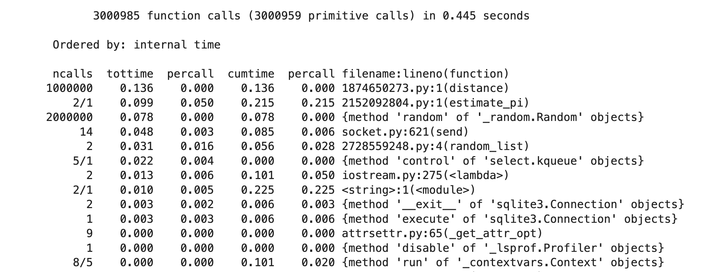

Lecture 3 2024.10.9

# Algorithms, Porfiling and Optimization

> > [!IMPORTANT]
> >
> > How to speed up my code?

## Lecturer

Dr **Marijan** (MAH - ree - yahn) Beg

- Office: RSM 4.95
- Email: m.beg@imperial.ac.uk
- Github: @marijanbeg

## Profiling -- Identifying Bottlenecks

### Stopwatch Approach

```python
import time
start_time = time.time()

# execution code

end_time = time.time()

wall_time = end_time - start_time
```

#### Wall Time VS CPU Time

`wall_time` is the time that we human feel, measured by the clock on the wall

`wall_time` = waiting for I/O + other processes + delays + `CPU_time` 

>  **CPU Time is the time we can change by code!**

#### How to mesure CPU time?

```python
start_cpu_time = time.process_time()
# execution
end_cpu_time = time.process_time()
cpu_time = end_cpu_time - start_cpu_time
```

### `timeit` Module

- Built-in module in Python Standard Library
- Can time the small bits of code
- Can be used as an <u>IPython</u> magic command: the magic command only worked in Jupyter environment.

#### `%timeit` magic (inline)

```python
timeit 1+2
```

Output: 

```bash
4.13 ns ± 0.00574 ns per loop (mean ± std. dev. of 7 runs, 100,000,000 loops each)
```

Runs 7 * 100000000 time of the code. The `7` and `10000000` time can be either automatically or manually changed according to to complexity of the execution code.

```python
# 10 runs * 100 per loop = run 1000 times
%timeit -r 10 -n 100 1 + 2
```

```
12.8 ns ± 1.76 ns per loop (mean ± std. dev. of 10 runs, 100 loops each)
```

Not accurate enough for 10 * 100

#### `%%timeit` magic (cell)

```python
%%timeit  # will do that ;)

n = 1_000_000
total = 0
for i in range(n):
    total += i
```

This can time the whole cell.

#### Iteration and Recursion

Usually, recursion is slower because multiple function calls.

### cProfile -- getting more details

`cProfile` provides detailed statistics on how much time was spent in each function. MORE Granular level.

#### `%prun` magic

```python
%prun estimate_pi(n=1_000_000)
```



- `ncalls`: Number of times the function was called.
- `tottime`: Total time spent in the function (**excluding** time in sub-functions).
- `percall`: Time per call (`tottime` divided by `ncalls`).
- `cumtime`: Cumulative time spent in the function **and** all sub-functions.
- `percall`: Time per call (`cumtime` divided by `ncalls`).

## Algorithms

### BigO

1. BigO gives the upper bound of the time consumed for an algorithm
2. BigO ignores constant factors: $O(3n^2+5n+7)$ is simplified as $O(n^2)$

#### In Computational Programming

Functions are usually selected from NumPy, TersorFlow or other libraries, which are the things that we cannot change or control. 

What we can optimize is that the codes or functions that is going to be called billions of times. Even 10% percent of performance enhancement can result in days of time saved.

## Optimization

### When

1. First correct, then fast.
2. Write test to make sure that optimization won't break the correctness
3. Profile it, measure the performance
4. Focus on the duplicated runs, that is when optimization matters
5. Consider the cost, if possible, buy a better hardware

### Algorithmic Opt

#### Select Better DS

```python
x = np.random.randint(0, 100, 1000)
y = np.random.randint(0, 100, 1000)
```

Goal: finding the common elements in these two array

if using a nested for loop, is $O(n^2)$, if using set, much better.

```python
def find_common_sets(x, y):
    return list(set(x) & set(y))
```

#### Use Third-party Library

```python
A = np.random.rand(100, 100)

def mean_loops(A):
    s = 0
    for i in range(A.shape[0]):
        for j in range(A.shape[1]):
            s += A[i, j]
    return s / A.size

def mean_numpy(A):
    return A.mean()  # or np.mean(A)
```

`mean_numpy` is about 250 times faster than `mean_loops`

##### Why is that?

C, a complied language, allowing faster execution than Python, while Python interpreted nature is slower.

Numpy Overcome this by <u>handling heavy computations outside the interpreter</u>.

#### Vectorization and SIMD

Vectorization eliminates the need for explicit loops in Python.

SIMD (Single Instruction, Multiple Data) enables parallel processing at the CPU level.

### Memoisation (caching)

> Do not compute the same thing twice.

```python
import functools

@functools.cache
def fibonacci(n):
    if n == 0:  # There is no 0'th number
        return 0
    elif n == 1:  # We define the first number as 1
        return 1
    return fibonacci(n-1) + fibonacci(n-2)
```

Store the output for the same function in cache, therefore saving the time.

#### Transfer the Hot Spots:

Transfer the hot spots, i.e. the few lines or functions in which most of the time is spent, to compiled code ([numba](https://numba.pydata.org/) or [Cython](https://cython.org/)).