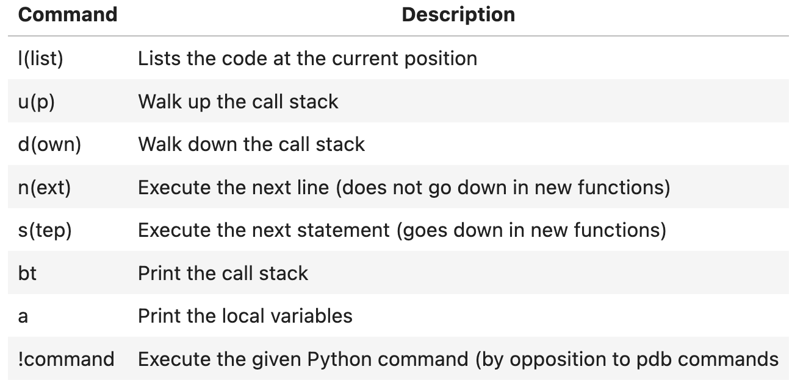
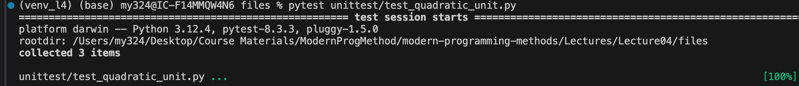

# Debugging and Testing

## Python Tracebacks

### List of Errors

1. `NameError`: 'x' is not defined
2. `ImportError`: importing a non-existing package from a library
3. `ModuleNotFoundError`
4. `IndexError`: e.g. list index out of range
5. `TypeError`: when tried to do the operation on an unsupported datatype
6. `SyntaxError`
7. `IndentationError`: unexpected indentation (e.g. a space at the beginning)
8. `RecursionError`: unlimited number of recursion

### Fast Static Analysis

flake8, pyflakes

(flake8-nb for .ipynb)

### Using IPython

1. Open terminal
2. make sure that IPython package is already installed
3. Type "ipython" to get into the ipython mode
4. `%run file_name.py` to run the file in the ipython
5. If error occurred, type `%debug` to launch ipdb (IPython Debugger)
6. When the terminal new line begin with `ipdb`, you are in
7. 

## Testing

### Unit Tests

Make sure that `pytest` is installed

Then use `pytest <path_to_test_file>`, the pytest automatically search for test files inside the folder and run the tests.

Results:



### The `doctest` Module

```python
import doctest

def mean(x):
    """Mean of a list of numbers.
    
    >>> mean([1, 5, 9])
    5.0
    
    """
    return sum(x)/len(x)

if __name__ == "__main__":
    doctest.testmod()
```

Syntax:

```python
""" # in the comments

>>> func()
expected_result

"""
```

How to run:

```bash
python3 -m file_name
```

> This run the test by calling the module as a script. 
>
> `-m` means run a module

## Auto Documentation

### Sphinx

