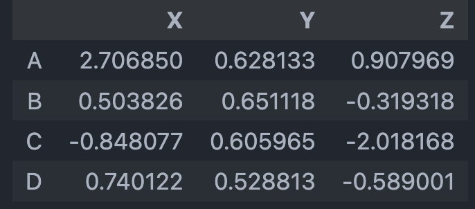

2024.10.17

# Lecture 8 Pandas

## Intro

Pandas in an open source library bulit on top of NumPy.

- Data preprocessing
- Offers high performance boost
- Bulit-in visualization
- Allow importing data in multiple format

```python
# Generate reproduceble random number
import numpy as np
np.random.seed(101)
```

## Panda Series

### Creating Series

Create form Python list

```python
my_list = [100,200, 300]
pd.Series(data=my_list)
```

Create while adding labels

```python
labels = ['x','y','z']
pd.Series(data=my_list,index=labels)
```

Create using NumPy array

```python
arr = np.array([100,200,300])
pd.Series(arr)  # integer label
pd.Series(arr, labels)  # predefined labels
```

Create from dictionary

```python
dic = {'x':100,'y':200,'z':300}
pd.Series(dic)
```

## Panda DataFrame

A `DataFrame` is a two-dimensional table. Each element is corresponding to both a row and a column.

### Create DataFrame

By hand:

```python
data = pd.DataFrame({'Course':['NPP','NPP','EDMS','EDMS','CM','CM'],
       'Person':['Bob','Sam','Amy','Vanessa','Carl','Sarah'],
       'Marks':[70,75,80,65,60,90]},
       index=['A','B','C','D','E','F'])
```

Through CSV:

```python
df1 = pd.read_csv('inputs/df1.csv')

# To make the first column as index column:
df1 = pd.read_csv('inputs/df1.csv', index_col=0)
```

Reading Excel Files:

```python
df = pd.read_excel('Excel_Sample.xlsx', sheet_name='Sheet1')
```

### Output

```python
df.to_csv('example.csv', index=False)
```

`index=False` can ignore the index column and output the rest.

### Selection



```python
df
df.columns
# Index(['X', 'Y', 'Z'], dtype='object')

df.columns
# Index(['A', 'B', 'C', 'D'], dtype='object')

df['Y']
df['Y', 'Z']

df['Y'].iloc[0]  # get the first element in column 'Y'

df.Y  # = df['Y']

df.loc['A']
df.loc['B','Y']  # Row first
df.loc[['A','B'],['Z','Y']]
df.iloc[0,:]  # or df.iloc[1], get the first row
df.iloc[:, 0]  # get the first column
```

#### Selection with Condition

```python
df[df>0]
# replace the element that <0 to Nan and return a new DataFrame

df[df['Z']>0]
# Return the rows that satisfy the condition where its column 'Z' >0

df[df['Z']>0]['Y']
# Based on the previous rows, select the column 'Y'
```

#### Multiple Condition

Using `|` as or

Using `&` as and

```python
df[(df['X']>0) & (df['Y'] > 1)]
```

```python
# Filter our rows where column 'Z' ha s missing values
df.loc[df['Z'].notnull()]
```

### Creating a New Column

```python
df['new'] = df['Z'] + df['Y']
```

### Dropping a Column

By default, the `drop()` method returns a new DataFrame with the specified column removed, but it doesn't modify the original DataFrame.

```python
df_1 = df.drop('new', axis=1)
# axis = 1 indicate dropping a column
# axis = 0 indicate dropping a row
```

### Delete a Column

```python
del df['Z']  # Delete directly
```

## Operations

### Unique Values

```python
# Get the unique vaules
df['col2'].unique()

# Get the number of unique values
df['col2'].nunique()

# Get a dictionary (element:counts)
df['col2'].value_counts()
```

###  Drop Duplication

```python
df.duplicated()  #.sum()
df.drop_duplicates(inplace=True)
```

### Data Summarizaion

```python
# Overall summarizaion
df.describe()

df['col2'].mean() # and .std(), .median() etc.
```

### Applying Function

#### `apply()` method

```python
def times2(x):
    return x*2
df['col1'].apply(times2)
```

#### `map()` and lambda function

Create new representations from existing data or <u>convert data from its current format into a desired format.</u>

```python
df_mean = df['col1'].mean()
df['col1'].map(lambda p: p - df_mean)
# convert each value in column 'col1' to the difference from their mean value
```

`map()` function apply the lambda function to each element of the target column.

### DataTypes

```python
# get the datatype overview
df.dtypes

# get the column's datatype
df['col2'].dtype 

# convert datatype
df['col2'].astype('float64')
```

### Concatenation

```python
# vertically concat
pd.concat([df1, df2, df3])
```

Remain columns as the same, concat the rows together.

### Merging

Two dataframs sharing  >= 1 columns


```python
pd.merge(left,right,how='inner',on='key')
```

Merge the colum and get a new data frame

### Joining

Remain row as the same, join the columns together

```python
left.join(right)  # Keep the rows same as 'left'

left.join(right, how='outer')  # all rows join
```

